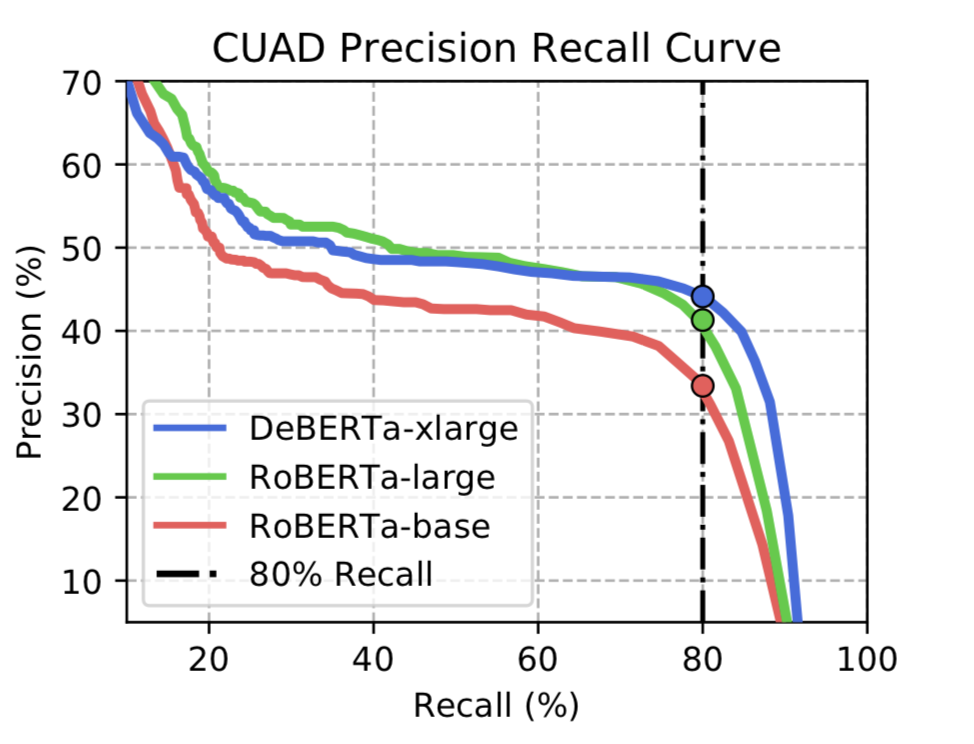
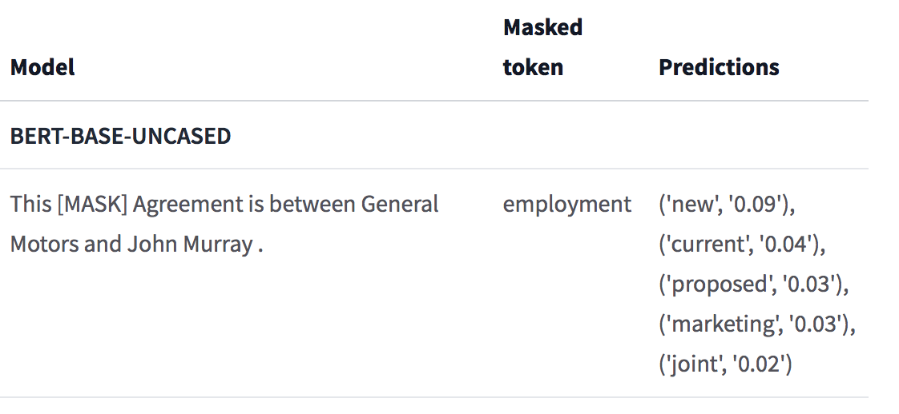

# LegalEagle: Automatic Contract Annotator
### Beri Kohen Behar, Lucas Pauker, Shashank Rammoorthy

## Problem Definition
Law firms spend around half their time doing contract review, and the billing rate for this task is often around $500-$900 an hour in the U.S. Automating contract review would be of great benefit to the legal community and consumers. Automation would save lawyers from work that they often consider drudgery and free them up to work on more involved aspects of the job. Furthermore, automating contract review could be used by consumers who do not have access to professional review services because of the prohibitive cost. This would make a huge difference for individuals and small businesses who often sign contracts without even reading them.

We designed a web application that allows a user to upload a legal contract in the form of text or a PDF, and receive an annotation of the contract. There are 41 common label categories that legal professionals look for in legal contracts, ranging from identifying the agreement date of the contract to a most-favored nation clause. Our NLP model extracts the parts of the contract corresponding to these categories and provides it to the user. The user can scroll through the annotations and export the results as a CSV file.

## System Design

  

Our system consists of 3 main components, all of which are running on a Virtual Machine on Google Cloud with a NVIDIA T4 GPU attached. We used NGINX as a reverse proxy and Gunicorn as a Web Server Gateway Interface (WSGI) server.
1. **ReactJS Frontend:** The frontend is a ReactJS web app. We use Mozilla’s [pdfjs](https://www.google.com/url?q=http://mozilla.github.io/pdf.js/&sa=D&source=editors&ust=1646982401364360&usg=AOvVaw0yFa3soZT9-zbLJmK5mK7H) library to parse contracts that are uploaded as PDFs. We have a clean UI that leverages Material UI components. The UI is designed to make it straightforward for a user to upload contracts. An HTTP request is made to our backend with the text of the contract as the payload.
1. **Python/Flask Backend:** We chose Python for our backend, mainly because it is easy to connect to the pretrained models we are using. Furthermore, there is good pre- and post-processing functionality for our model inputs. We used Flask, a micro web framework for Python, to serve requests. The focus in Flask is to minimize the boilerplate code needed to get a simple app up and running.
We use Flask to build an API that handles requests from our frontend, and returns responses back to the client. The data in the API request contains the document in string form, and an associated list of questions. The backend calls the model and passes along the inputted data - and the eventual API response to the client consists of a list of question-answer pairs. 
1. **Machine Learning Model:** We weighed the tradeoffs of hosting our ML model for inference on a different machine and decided that having the model inference process running on the same VM as the Flask server would make it easier to maintain our app and easier to make changes. We attached an NVIDIA T4 GPU to the existing VM in order to speed up inference.   
\
The model is loaded into the GPU’s memory when the inference process is first initialized. This is helpful because it means that the model does not have to be reloaded every time a call is made.  
\
As an aside, we also uploaded our model to HuggingFace and tried to use their accelerated inference API. This seemed like an appealing method because all the computation including most of the preprocessing of data is handled by HuggingFace, but due to unforeseen issues we were not able to go down this path.  

## Machine Learning Component

### Dataset
The data for our model comes from the [Contract Understanding Atticus Dataset](https://www.google.com/url?q=https://www.atticusprojectai.org/cuad&sa=D&source=editors&ust=1646982401365960&usg=AOvVaw3n_h3WhrORwlQEzBSiwpnU) (CUAD), which is a dataset developed by the Atticus Project, a non-profit organization in the legal space. The dataset has over 500 contracts and more than 13,000 expert annotations that span 41 label categories. Using this dataset allowed us to effectively build a model to highlight important clauses in legal contracts.

Notably, a key insight of the authors was to structure the dataset in the same manner as the SQuAD 2.0 dataset (Rajpurkar et al.). In particular, what this means is that questions in the dataset are formatted like so: _“Highlight the parts (if any) of this clause related to [KEYWORD]. Details: [KEYWORD_DETAILS]”_.

### Task Definition
As mentioned earlier, there are 41 label categories in the dataset. The task at hand is effectively extractive question-answering. That is, given a question and a passage, the task of the model is to output start and end token indices of a span of text that relates most to the question. The model can also choose not to output any answers for a question. This is important because it is common for contracts to not have information about all 41 label categories. Intuitively, the model learns how to highlight important parts of a contract as lawyers do. Below is an illustration of some example labels from Hendrycks et al:

  

### Architecture & Training
The authors of the [CUAD paper](https://www.google.com/url?q=https://arxiv.org/pdf/2103.06268.pdf&sa=D&source=editors&ust=1646982401367526&usg=AOvVaw2cwm0ryYBKz78BDlEoV186) demonstrate that NLP transformer models can achieve reasonable performance on the CUAD dataset. They use several pre-trained language models using the HuggingFace Transformers library, and fine tune these models on the CUAD dataset.

We used the publicly available [code](https://www.google.com/url?q=https://github.com/TheAtticusProject/cuad&sa=D&source=editors&ust=1646982401367994&usg=AOvVaw2MRzOk441c0Xl_VMflXpc6) the authors provide to train and evaluate RoBERTa-base and replicated their performance metrics. Below is a Precision-Recall graph from the paper, note how the auPR statistics vary with smaller and larger models.

  

### Improving the Model

Since the authors already used the state of the art NLP transformer models, we determined that improvements could be made using more data, and a different training process. The authors use transformers that are pre-trained on general language. BERT, for instance, is trained on a corpus consisting of the BooksCorpus ([Zhu et al.](https://www.google.com/url?q=https://arxiv.org/abs/1506.06724&sa=D&source=editors&ust=1646982401368683&usg=AOvVaw0IIiw0mwaZgbY2s-mE9aja)) and English Wikipedia. There is likely some intersection between that pre-training corpus and the text one typically finds in legal documents, but we believe there is significant room for improvement.

A classic transformer such as BERT typically treats domain-specific words as rare tokens. While this does not imply that the model will produce meaningless results (it had reasonable performance as shown above), it does mean that a better pre-trained model that is better suited for representing legal domain language could be used. Therefore, we propose running the supervised fine-tuning on [LegalBERT](https://www.google.com/url?q=https://huggingface.co/nlpaueb/legal-bert-base-uncased&sa=D&source=editors&ust=1646982401369123&usg=AOvVaw3f9QGoRkv_2Cz0OMLMvrc7) models, a family of transformers that are pre-trained on English contracts.

Below is a masked language modeling example from HuggingFace’s page for LegalBERT that demonstrates that the LegalBERT models seem to learn a better representation of the legal domain compared to standard BERT models:

  

  

## System Evaluation
We replicated the training and evaluation process of the authors to show that fine tuning on RoBERTa-base reaches an Area Under the Precision Recall Curve of 42.6, and Precision at 80 Percent Recall of 31.1 percent. “Precision @ x % recall” metrics are useful because high recall is a requirement for the usefulness of the application, while higher precision improves user experience.

This metric essentially means that lawyers can use our web app, read over model outputs, and spend some time on manually filtering out the false positives (which happen around two thirds of the time). This would save hours of work compared to reading a whole document, though it’s unclear what recall value law firms would consider reasonable to work with. There appears to be [plenty](https://www.google.com/url?q=https://bernardmarr.com/how-ai-and-machine-learning-are-transforming-law-firms-and-the-legal-sector/&sa=D&source=editors&ust=1646982401371982&usg=AOvVaw3CqILZhpukShuZJ-jPZw88) [of](https://www.google.com/url?q=https://jolt.law.harvard.edu/digest/a-primer-on-using-artificial-intelligence-in-the-legal-profession&sa=D&source=editors&ust=1646982401372336&usg=AOvVaw0KvHlqyTldrBMvHheW_taP) [buzz](https://www.google.com/url?q=https://www.lawtechnologytoday.org/2021/02/using-artificial-intelligence-to-improve-law-firm-performance/&sa=D&source=editors&ust=1646982401372678&usg=AOvVaw02ih5EArpMJhze0FJD902x) about using AI in the legal community though, which is a good sign.

For our other use case of consumers understanding legal contracts before signing them, however, the metrics on RoBERTa-base are definitely reasonable. Individuals can upload contracts such as agreements with banks to get information about the contract, rather than not reading the contract at all.

Finetuning LEGAL-BERT-SMALL for 3 epochs with batch size 8 on this question-answering task led to reasonable metrics - an auPR of 0.325. We tried to finetune LEGAL-BERT-BASE as well, but could not finish training due to memory complications. An extension to this project, one we intend on working on in the near future, is doing multi-GPU training with larger batch sizes and larger transformer models.

Another aspect of the model that was important for us was inference time. To reduce inference time, we used a GPU. On a CPU with 8GB of memory, inference took about 4 seconds per question per page of contract. On the T4 GPU, inference took about 0.08 seconds per question per page of contract. This represents a speedup of 50x.

## Application Demonstration

Our application is very simple to use. It lets the user input a legal document, either in a text box, or as a PDF upload. The user can click the process button to request an annotation. We show a loading bar, along with an estimated response time based on our inference tests. This response time is a linear function of the length of the document.

The output of the model pops below the text box, and the user can scroll through the annotations. We group the annotations by the paragraph they appear in, and only display paragraphs that have at least one annotation. When the user hovers over the question (on the right side), they can see the corresponding answer highlighted on the left. Finally, the user can export the results as a CSV file.

Below are some GIFs of the app. Here is the landing page:

  

Here is the input interface:

  

Here is the results screen:

  

## Reflection
### What Worked

The UI is very simple, and provides a smooth user interface in terms of viewing annotations in an intuitive way. Our design was inspired by the SQuAD website’s [visualization tool](https://www.google.com/url?q=https://rajpurkar.github.io/SQuAD-explorer/explore/v2.0/dev/&sa=D&source=editors&ust=1646982401374972&usg=AOvVaw2vJ49kLqh5IIFnKDsOhSeO).

On the machine learning side, we were able to take advantage of the HuggingFace SQuAD libraries. This saved us a lot of time when implementing data preprocessing and post processing (for training and inference). We still had to implement some custom logic, but we didn’t have to code these from scratch. Starting with a high quality dataset and a readily available model with reasonable performance was a great idea too. We knew that whatever results we got from our modeling iterations, we could fall back to this model, which we did for our demo.

### Challenges
As mentioned earlier, we used the same VM for both the Flask process and the GPU model inference. Setting up NGINX on our VM to accept requests from clients and forward them to the Flask server was challenging. We also set up our VM instance such that the NGINX process was spawned at boot time, as were the Flask and PyTorch processes.

The question/answering task requires complex models, which means that high performing models need to be trained on gigabytes of data and take up at least a few hundred MBs (for the best models a few GBs) storage space. In general, training requires significant computation and time, so experimenting with different models and hyperparameters was challenging with our limited resources (compute, power and time). In addition, using GitHub with large models proved to be challenging because the git large file system has [storage and bandwidth limits](https://www.google.com/url?q=https://docs.github.com/en/repositories/working-with-files/managing-large-files/about-storage-and-bandwidth-usage&sa=D&source=editors&ust=1646982401376404&usg=AOvVaw0oaGAqpOcKS0s-uzFtt6xV).

### Possible Improvements

**User Interface:** Different customization features could improve user experience for law firms and regular users, so it would make sense to have the user select whether they’re a lawyer or a regular user on our landing page. After this, lawyers could use a dropdown menu to select the questions they’re interested in. We could also provide several models that offer a trade-off between performance and inference time. Another interesting feature that law firms might be interested in could be displaying multiple predictions for a single question category. Our model outputs multiple results and we currently use the one with the highest probability score. For “difficult” questions with lower performance, we could let the user view multiple predictions and select their preferred one.

For regular users, it would be helpful to have some supplementary explanations. Some of the label categories use confusing legal language, such as “most favored nation.” For these categories, we could display an information button that users can click on to view a brief non-technical description of the category.

**Backend:** If we deployed this web app and expected significant traffic, then we would want to isolate regular backend operations with model inference. To do this, we could use multiple GPUs and parallelize data processing and inference (even for a single user by splitting questions across GPUs rather than running all 41 questions on the same GPU). With a higher budget, this could be done using Sagemaker, which spawns new instances to perform inference as necessary.

**Modeling:** As mentioned above, we are still working towards using a model that is pre-trained on a large corpus of unlabeled legal contracts. This type of domain adaptation has proven to be useful in many domains and we think that this is a promising pathway. With more data, another path forward would be fine-tuning separate models for separate contract categories. After uploading a contract, the user could select a category such as “credit card agreement,” and their contract would be fed into the model that is fine tuned on credit card related documents. Contracts that don’t fit into a common category could still be fed into a general model.

## Broader Impacts

There are already a few companies that provide automated contract review with lawyers in the loop. Our application is the first (as far as we know) to use a state of the art question/answering model for legal contract review. We recognize the limitations of our application, and that an 80 percent recall might not be enough for some law firms. Our application is especially promising for use by individuals and small businesses who do not have access to contract review services because of their prohibitive costs. For example, an individual who doesn’t have time to read their housing contract could use our web application to quickly learn about possible problematic clauses. The label categories are designed not only to extract essential information such as parties and expiration date, but also problematic clauses that might place a party in a risky situation.

An unintended use of the system would be to use it to design adversarial contracts: contracts wherein it is difficult to extract clauses. To mitigate this scenario, we could rate-limit customers or otherwise use differential privacy techniques to store past versions of a contract that was analyzed to try and keep up with adversarial inputs.

## References
- Devlin, Jacob, et al. "Bert: Pre-training of deep bidirectional transformers for language understanding." arXiv preprint arXiv:1810.04805 (2018).
- Hendrycks, Dan, et al. "Cuad: An expert-annotated nlp dataset for legal contract review." arXiv preprint arXiv:2103.06268 (2021).
- Pranav Rajpurkar, Robin Jia, and Percy Liang. Know what you don’t know: Unanswerable questions for squad. ArXiv, abs/1806.03822, 2018.
- Yukun Zhu, Ryan Kiros, Rich Zemel, Ruslan Salakhutdinov, Raquel Urtasun, Antonio Torralba, and Sanja Fidler. 2015. Aligning books and movies: Towards story-like visual explanations by watching movies and reading books. In Proceedings of the IEEE international conference on computer vision, pages 19–27.

